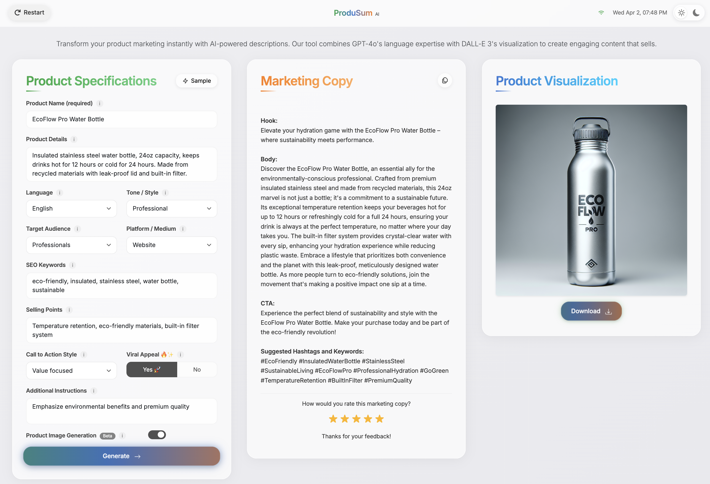

# Produsum AI - Marketing Content Generator

Produsum AI is a modern web application that uses OpenAI's GPT-4o and DALL-E 3 to generate compelling product descriptions and visualizations. Perfect for marketing teams, e-commerce businesses, and content creators.


## Overview

Produsum AI helps you create professional marketing content quickly and easily:


Generate both text descriptions and images for your products:



## Features

- **AI-Powered Marketing Copy**: Generate professional product descriptions using OpenAI's GPT-4o
- **Visual Product Representation**: Create stunning product visualizations with DALL-E 3
- **High Customization**: Control tone, style, audience, keywords, and more
- **Real-time Generation**: Watch the content being created with progress updates
- **User-Friendly Interface**: Modern UI with dark/light mode for comfortable use
- **Responsive Design**: Works on desktop and mobile devices
- **Share & Export**: Copy text content and download generated images

## Demo

Here's what you can do with Produsum AI:

1. Enter your product details and preferences
2. Click "Generate" to create marketing copy
3. Toggle "Product Image Generation" to generate a visualization
4. Copy the text and download the image for your marketing materials

## Requirements

- Python 3.8+
- OpenAI API key (with access to GPT-4o and DALL-E 3)
- Modern web browser that supports WebSockets

## Installation

1. **Clone the repository**
   ```bash
   git clone https://github.com/yourusername/produsum.git
   cd produsum
   ```

2. **Run the start script**
   ```bash
   ./start.sh
   ```
   This script will:
   - Create a virtual environment if it doesn't exist
   - Install dependencies
   - Create a .env file from the example if needed
   - Start the application

3. **Configure your OpenAI API key**
   Edit the `.env` file to add your OpenAI API key:
   ```
   OPENAI_API_KEY=your_api_key_here
   ```

4. **Access the web interface**
   Open your browser and navigate to:
   ```
   http://localhost:3000
   ```

## Manual Installation

If you prefer a manual setup:

1. **Create a virtual environment**
   ```bash
   python -m venv venv
   ```

2. **Activate the virtual environment**
   - Windows:
     ```bash
     venv\Scripts\activate
     ```
   - macOS/Linux:
     ```bash
     source venv/bin/activate
     ```

3. **Install dependencies**
   ```bash
   pip install -r requirements.txt
   ```

4. **Set up environment variables**
   ```bash
   cp .env.example .env
   ```
   Then edit the `.env` file to add your OpenAI API key and other settings.

5. **Start the application**
   ```bash
   python app.py
   ```

## Configuration Options

You can customize the application by modifying the settings in the `.env` file:

- `OPENAI_API_KEY`: Your OpenAI API key
- `PORT`: The port on which the server runs (default: 3000)
- `HOST`: The host address (default: 0.0.0.0 to allow external connections)
- `FLASK_DEBUG`: Enable debug mode (True/False)
- `DEFAULT_MODEL`: The OpenAI model to use (default: gpt-4o)
- `DEFAULT_IMAGE_MODEL`: The image model to use (default: dall-e-3)
- `ENABLE_CACHING`: Enable result caching to reduce API calls (True/False)
- `ENABLE_IMAGE_GENERATION`: Enable DALL-E image generation (True/False)

## Cost Management

Be aware that using OpenAI's APIs incurs costs. The application includes several features to help manage these costs:

- **Caching**: Identical requests use cached results to avoid redundant API calls
- **Usage Tracking**: Monitor your API usage within the application
- **Configurable Limits**: Set usage limits to prevent unexpected costs

## Security Notes

- This application requires an OpenAI API key which incurs costs
- Never commit your `.env` file or expose your API key
- For production use, set specific CORS origins instead of the wildcard "*"
- Add authentication and rate limiting for public-facing deployments

## Browser Compatibility

Produsum AI works best with:
- Google Chrome (latest)
- Mozilla Firefox (latest)
- Safari (latest)
- Microsoft Edge (latest)

## License

MIT License - See LICENSE file for details.

## Contributing

Contributions are welcome! Please feel free to submit a Pull Request or open an Issue to suggest improvements. 